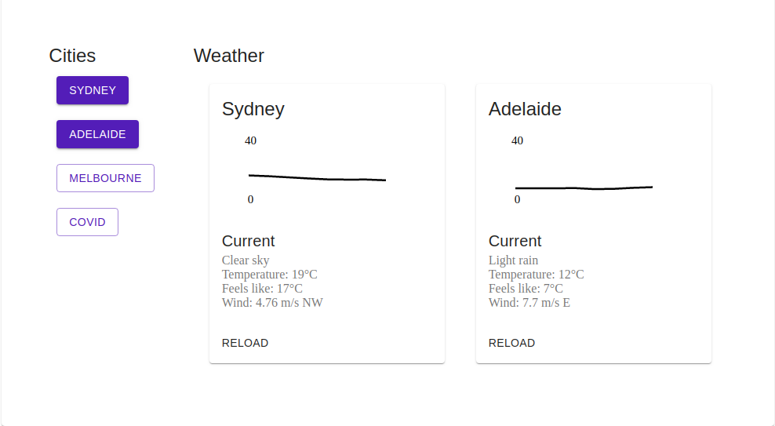

# Outcomex Tech Challenge



## Building

### Using Docker

The only important thing is to provide your openweathermap api key as a flag (or environment variable) to the program. You may also specify a custome host for the API using `--api-host=0.0.0.0:12345`

```
docker build -t outcomex .
docker run -it -p 3000:3000 outcomex --api-key="123"
```

You can then view the application in your browser at localhost:3000.

### Testing

For testing make sure you have a openweathermap api key available as an environment variable as `$API_Key` then run `go test ./...`. 

### Docs

## Application Structure

A good entrypoint to get started is with Docker, however you can also use go modd to run the app in development mode and the application will restart as you make changes. 

The internal directory is for go source that could become it's own go module, the code in this folder is completely domain agnostic and could be turned into it's own module if required. 

The cmd directory contains a set of commands to facilitate using this application. Currently the only command is api which runs the server; however, if there were migrations or an admin tool in this project it would also live in this directory. Code in this directory is specific to this application and should not be copied or used in other applications.

The front-end directory contains the source code required to run a browser application. It is mostly boiler plate create react app code. The three main files are in src/ and are `App.js` which houses the main application structure. `City.js` which contains view logic for displaying a city card, and `ForecastImg.js` which contains logic for creating a SVG (image) of a forecast.

Note: City.js is currently doing two things. It is responsible for fetching data from the server _and_ it is responsible for displaying that data. This is not a great design and should be seprated into two compoments for the two tasks. 

## Dependencies

### https://openweathermap.org/api

This is the API used for fetching the weather forecasts. An API key is required to run either the tests or the server for this application.

### Ardanlabs/conf

This is a Golang package for parsing command line arguments. It is completely unnecessary considering the size of the project (there are only two arguments avialable), but it's such a useful feature with such minimal implementation cost I added it anyways. 


### Testify

This is a assertion and mock library for Golang. I use only the assertion part of the library. I should be using mocks, but as explained below I opted for integration tests instead to save time.

### Material UI

React UI library.

### Axios

React http client library.

### Lodash & Immutability Helper

React utility liraries. These are probably unnecessary but help me write cleaner code that is more maintainable.

## Improvements 

Imporvements broadly fall into two categories. First, improvements to the code to make it more reliable, resiliant, and readable. Second, improvements to the feature set of the application. While I try to separate these improvements into distinct categories there is a lot of overlap and some features exist in both categories. 

Further more some features would require input from the product owner, I have only included features that I think would be close to universially required. 

### A map on frontend

It would be great to have a homescreen with a map on it and a user could click on the location they were to get the weather. It would be even better if the browser figured out the users location and got relevant information without requiring input.

### A picture of the weather

There could just be a simple picture of the weather in the current weather section. This would help the user get a quick indication of the weather without needing to read the text. This helps with accessiblity.

### Improvements to the SVG generator

The SVG that is generated leaves a lot to be desired. The image needs to be cleaned up with color and styling, as well as labels on the x axis and a more detailed y axis. It would also help with usability if the y axis dynamically adapted to the bounds of the range this would help with removing excess white space. It also may be valuable to allow the user to specify how long they want the forecast to go for. Right now only images with a time range of eight hours are generated. 

### Accessibility Improvements

The styles are pretty shocking. I take a much longer time to generate a design than generating software. In particular, the responsiveness is funky and needs some more thought. It is responsive, but the layout on a phone just doesn't look quite right. Additionaly the typography in the current weather section is bad. 

### Usability

Usability would be greatly enhanced with a make file so commands could be run indpendent of each other. Right now there is a dockerfile which does everything required to deploy the app, but the application does not have a great development environment. The best thing to do would probably be eject from the create react app scripts and create a build process. This is partially done using Modd, but it calls `npm run build` which makes a optimized build which exactly not what you want for development.

## Design decisions

### Reliability

The openweathermap api has a pretty shocking aviailability SLA, depending on the service requirements of this app it would be good to fall back to another API in the case that openweathermap was down. Fail this it would be good to monitor openweathermap automatically. This would save a lot of time bug hunting when openweathermap was the source of the bug.

Also there is no tracing or metrics on the endpoints. This is simply because the design goal was not to create a production ready app. Using a Zipkins and Prometheus reporter and configuring them through the command line args would be the way to go. Alternatively, if Go ever gets a framework like Scala Finagle that would work instead of Prometheus and Zipkin exporters.

### Testing

There is no testing in the React app :(. That is because the focus of this exercise is to prove what I can do as a developer, and tests in themselves do not add value (I didn't have time to write tests). If I had more time I would write snapshot tests of the City and ForecastImg components. This would require refactoring the City component into two components (one for fetching data one for displaying it) which would probably be beneficial any ways. 

Likewise the backend tests are not quite correct. There are integration tests in /cmd/api/internal/routes which are fine, but there is also integration tests in /internal/weather. These tests should be changed to unit tests using mocks because the code they tests is a shared out of process dependency. By using an integration test I no longer resistent to refactor and the tests are slow. In a real project I would rather delete this test then have it as is because it offers very little value (is redundent on the proper integration tests) and will make development a pain.

Additionally, there is very little logic to tests, the backend is essentially just a pass through for openweathermap, so any unit tests will have ver little value as well. 

If there were unit tests that would provide value you would see that I subscribe to the classical unit test style philosophy (not London). Where the unit of isolation is the unit test (not the unit of code), and as such I am able to tests features not functions.  

### Front-end

Like with testing the front end needs a lot more attention than I gave it. In particular the loading and error states would likely need to be abstracted very soon. I only write abstractions once a function has duplicate code. Since the front-end has so few features these abstractions were not necessary. 

In the same vein I did not use a router because there is no need for that abstraction when only one route is present, but as the application grew I would probably add a router very quickly. 

I used `useState` for state managment. Redux would probably be a better option for a larger application. This would also alleviate the problems I had with sharing state between the list of cities component and the weather display component, but for such a small application I did not feel it was necessary.

Like with the two above examples I felt that an application that would not undergo continuous development would not benefit from a type safe language (TS or Reason)

Since we have talked about state managment and type safety wouldn't it be great if there was a language that did this and had immutability built in to the language. Wouldn't it be great if this language was designed to build browser applications similar to the React ecosystem? Please ask me about this in the interview! Yes I am making sure you read _all_ my documentation :p... I wrote it for you.

It would be great to cache the weather. Right now the weather for a city is fetched each time the city is toggled on. It would be great to have a cache so this would not happen. Additionally, after this cache could be used to automatcially refresh the weather every minute.

The design isn't great. That would probably be low hanging fruit for a designer to help out with.

### Back-end 

I used the default `net/http` router because one of the requirements was to use as few dependencies as possible and I have always wanted to mess around with that library. In production I would use Gorilla, Chi or similar.

I make heavy use of internal folders, and similarly in packages am hyper alert about what gets exported. I keep my API service as small as possible to make the API as easy to grok as possible, and to make sure as much detail is an implmentation detail as possible. 

There are no docs for this API. With more time I would have added some Swagger docs. In the same line of thought there are also other non-functional requirements which are absent including CORS, health checking, a version endpoing, graceful shutdowns, and support for SSL. These things are important for production systems, but not for demonstrations. 

Similar to the front-end there are some abstractions that would surely happen as the application grew, but with such a small feature surface are unnecessary. IN particular adding middleware and a lot of the boilerplate in `handleWeather` that deals with handling requests and responses.

### Odds & Ends 

Just some odds and ends that would be essential in a production system: the proper git commits would be great, I opted out of this because I didn't have any issue numbers to use as commits. Also separate git branches: in a team using gitflow or by myself using master/tag. Lastly having CI/CD to automatically run tests and deploy the system as I added new features would be essential. In a vacuum I would use CircleCI to handle most of this, but most teams already have some solution for this type of stuff. 
